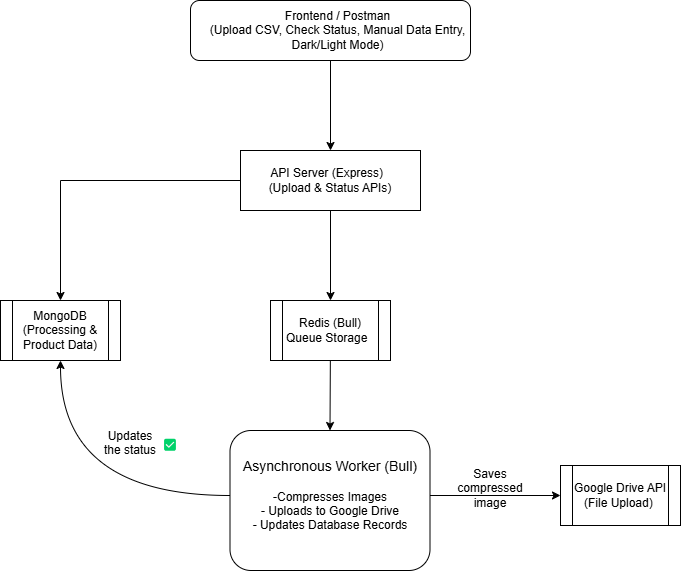

# LLD



# Database Schema

Two primary collections (or tables) are used:

## ProcessingRequest

Fields:

- `requestId` (String, unique): A unique identifier for the entire CSV processing job.
- `status` (String, enum): One of `["PENDING", "PROCESSING", "COMPLETED", "FAILED"]`.
- `totalImages` (Number): Total number of images in the CSV.
- `processedImages` (Number): Number of images that have been processed.
- `products` (Array of ObjectId references): References to individual `ProductImage` documents.
- `createdAt` (Date)
- `updatedAt` (Date)

## ProductImage

Fields:

- `requestId` (ObjectId, reference): Reference to the associated `ProcessingRequest`.
- `productName` (String): Name of the product.
- `inputUrls` (Array of Strings): Original image URLs from the CSV.
- `outputUrls` (Array of Strings): URLs for the compressed/processed images (uploaded to Google Drive).
- `downloadUrls` (Array of Strings): (Optional) Direct download links.
- `status` (String, enum): One of `["PENDING", "PROCESSING", "COMPLETED", "FAILED"]`.
- `createdAt` (Date)

## API Documentation

### 1. Upload API

- **Endpoint:** `POST /api/upload`
- **Description:** Accepts a CSV file containing product image URLs. The field name must be `csvFile`.
- **Request:**
  - **Content-Type:** `multipart/form-data`
  - **Form Field:** `csvFile` – the CSV file.
- **Response Example:**
  ```json
  {
    "status": "success",
    "requestId": "a1b2c3d4e5f6g7h8",
    "message": "CSV processing started"
  }
  ```
- **Processing:**
  - Validates CSV formatting.
  - Creates a `ProcessingRequest` document and individual `ProductImage` records.
  - Enqueues asynchronous image processing jobs.

### 2. Status API

- **Endpoint:** `GET /api/status/:requestId`
- **Description:** Returns the current processing status for the given request ID.
- **Response Example:**
  ```json
  {
    "status": "success",
    "requestId": "a1b2c3d4e5f6g7h8",
    "overallStatus": "PROCESSING",
    "totalImages": 10,
    "processedImages": 4,
    "products": [
      {
        "productName": "SKU1",
        "status": "COMPLETED",
        "inputUrls": [
          "https://example.com/image1.jpg",
          "https://example.com/image2.jpg"
        ],
        "outputUrls": [
          "https://drive.google.com/...",
          "https://drive.google.com/..."
        ]
      }
      // ... more products
    ]
  }
  ```
#
